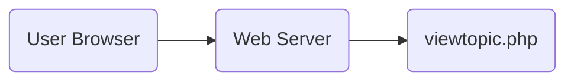

# Data Flow & Request Lifecycle

## 🌊 Overview
This document describes how data moves through the FluxBB (Visman Fork) system, from the initial HTTP request to the final HTML response.

---

## 1. The Entry Point
Every user interaction starts with a request to a root PHP file (e.g., `viewtopic.php?id=10`).

## 2. Bootstrapping (`include/common.php`)
Before any specific page logic runs, `common.php` initializes the environment.

1.  **Environment Sanitization:**
    *   `error_reporting` is set.
    *   `setlocale` is called.
    *   `mb_*` (Multibyte String) settings are configured.

2.  **Configuration Loading:**
    *   `include/config.php` is read to get DB credentials.
    *   **IF MISSING:** Redirect to `install.php`.

3.  **Database Connection:**
    *   `include/dblayer/common_db.php` is included.
    *   `$db` object is instantiated (factory pattern based on `$db_type`).

4.  **Global Cache Loading:**
    *   `cache/cache_config.php` is loaded.
    *   Populates `$pun_config` array (Site title, time zone, etc.).
    *   **IF MISSING:** `generate_config_cache()` is called to rebuild it from the DB.

5.  **User Authentication:**
    *   `check_cookie($pun_user)` is called.
    *   **Result:** `$pun_user` contains either the logged-in user's row from `users` table OR the Guest user's row.
    *   **Side Effect:** Updates "Online" status/last visit time.

6.  **Extension Hooks:**
    *   `include/addons.php` loads active addons.

---

## 3. Page Logic (The Controller)
Once bootstrapped, the specific script (e.g., `viewtopic.php`) takes over.

1.  **Input Validation:**
    *   `$id = isset($_GET['id']) ? intval($_GET['id']) : 0;`
    *   If `$id < 1`, trigger `message($lang_common['Bad request'])`.

2.  **Authorization:**
    *   Check permission: `if ($pun_user['g_read_board'] == '0') ...`
    *   Check topic permission: Query to ensure the topic exists and is not in a restricted forum.

3.  **Data Retrieval:**
    *   SQL Query: Fetch topic data.
    *   SQL Query: Fetch posts (paginated).
    *   **Parsing:** Post content is parsed via `parse_message()` (in `include/parser.php`) to convert BBCode to HTML.

4.  **Action Processing (POST requests):**
    *   If the request is a POST (e.g., `post.php`), data is written to the DB.
    *   `redirect()` is called to send the user to the new content.

---

## 4. Response Rendering (The View)

1.  **Header Output:**
    *   `require 'header.php';`
    *   Starts Output Buffering (`ob_start`).
    *   Outputs the HTML `<head>`, `<title>`, and navigation menu.

2.  **Content Output:**
    *   The script echoes HTML content directly.
    *   Loops through DB results to output rows (e.g., table of posts).

3.  **Footer Output:**
    *   `require 'footer.php';`
    *   Outputs copyright, debug info, and closing `</body>`.
    *   **Template Injection:**
        *   The entire output buffer is captured.
        *   `include/template/main.tpl` is loaded.
        *   Placeholders (e.g., `<pun_main>`) are replaced with the buffered content.
        *   Final HTML is sent to the browser.

---

## 💾 Cache Flow
To avoid hitting the database for static configuration:

1.  **Write:** `admin_options.php` updates settings -> Calls `generate_config_cache()` -> Writes `cache/cache_config.php`.
2.  **Read:** `common.php` includes `cache/cache_config.php`.

---

## 🛡 Security Data Flow

### Input
*   **GET/POST:** cleaned via `pun_trim`.
*   **Strings:** `pun_htmlspecialchars()` converts special chars to entities.
*   **Invisible Characters:** `forum_remove_bad_characters()` strips control characters.

### Output
*   **HTML:** All user-generated content must pass through `pun_htmlspecialchars()` before echo.
*   **SQL:** All parameters must pass through `$db->escape()` or be cast to `intval()`.
